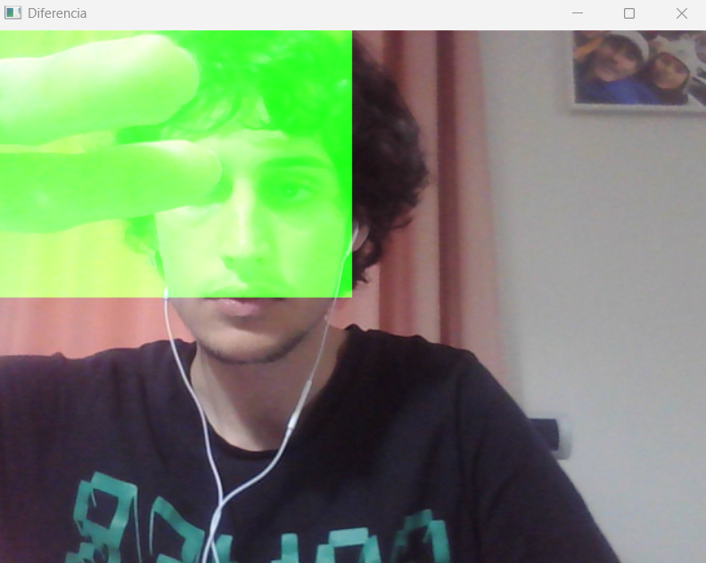

## Práctica 2. Funciones básicas de OpenCV

### Contenidos

### Primer apartado

En este ejercicio se analiza una imagen procesada con el detector de bordes Canny para identificar zonas con alta densidad de bordes horizontales:
Calcula la densidad de píxeles blancos (bordes) por filas y columnas, normalizando los resultados entre 0 y 1
Encuentra las filas con máxima densidad de bordes estableciendo un umbral del 90% del valor máximo
Identifica las posiciones de las filas que superan este umbral y visualiza los resultados mostrando la imagen Canny original junto con un gráfico de la distribución de bordes por filas
El objetivo principal es detectar automáticamente las filas donde se concentran la mayoría de los bordes horizontales en la imagen.

### Segundo apartado 

En este apartado se realiza un análisis de distribución de intensidades en una imagen.
El codigo calcula el histograma de la imagen en escala de grises para visualizar la distribución de tonos desde 0 (negro) hasta 255 (blanco) para analizar la densidad de píxeles blancos por filas y columnas en una imagen umbralizada, identificando las zonas con mayor concentración con estos datos 
dibuja líneas rojas verticales y verdes horizontales en las posiciones que contienen al menos el 90% de la máxima densidad de píxeles para poder visualizar el resultado.

### Tercer apartado 

Para realizar la tarea se ha decido implementa un procesador de video en tiempo real con múltiples efectos:

Inicializa la cámara web y define cuatro modos de operación: normal, saturación, detección de píxeles extremos, y collage pop-art con variaciones de color

Procesa cada fotograma aplicando diferentes efectos según el modo activo:

Modo 1: Invierte el canal rojo con franjas horizontales del original

Modo 2: Detecta y marca los píxeles más claro y oscuro de la imagen

Modo 3: Crea un collage 4x4 con variaciones de tono y saturación

Para cambiar entre los modos se imprimen instrucciones en pantalla sobre los controles (teclas M, N, B) para cambiar entre los diferentes modos de procesamiento.

### Cuarto Apartado

En esta ultima tarea hemos tratado de implementar un rudimentario detector de movimiento por cuadrantes en tiempo real para ello se divide la imagen
de la cámara en 4 cuadrantes iguales (arriba-izquierda, arriba-derecha, abajo-izquierda, abajo-derecha) usando operaciones de división horizontal y vertical. 
Se calcula las diferencias de movimiento entre fotogramas consecutivos para cada cuadrante  para identifica la zona con mayor actividad. 

Resalta visualmente la zona activa aplicando diferentes colores según el cuadrante ganador:

Azul para arriba-izquierda

Verde para arriba-derecha

Rojo para abajo-izquierda

Amarillo para abajo-derecha

