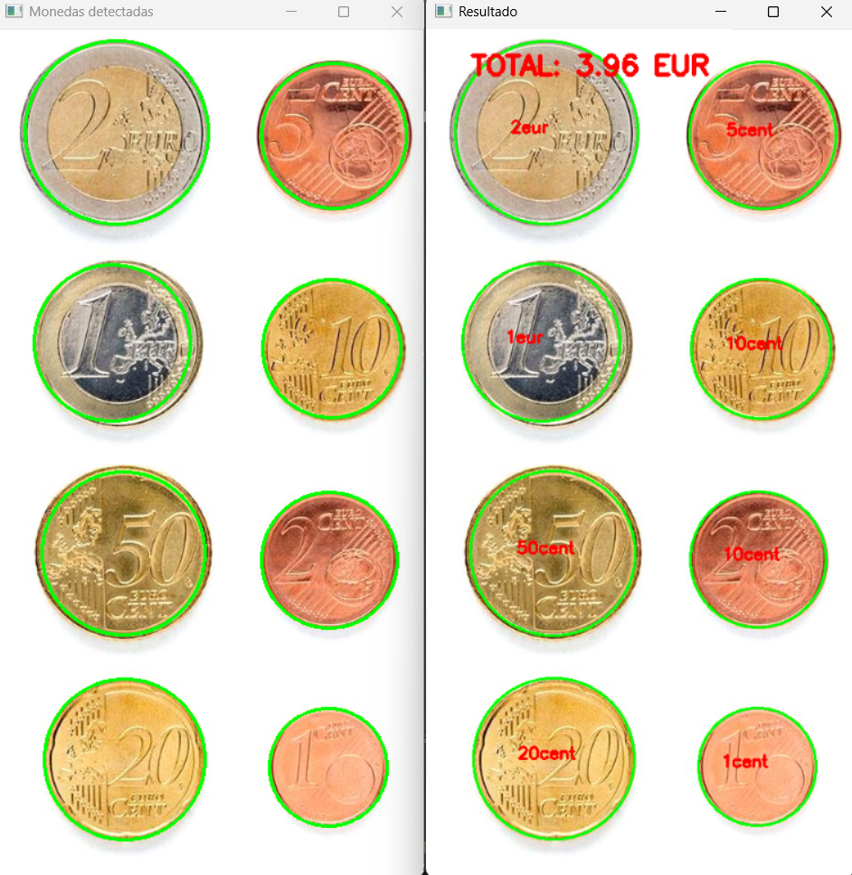
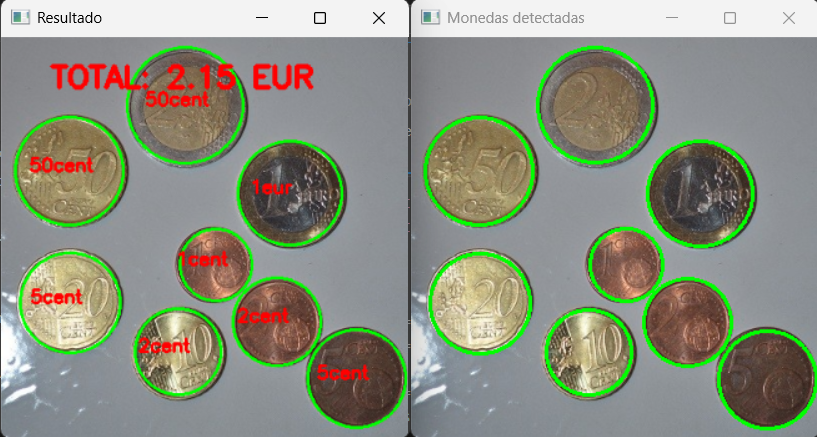
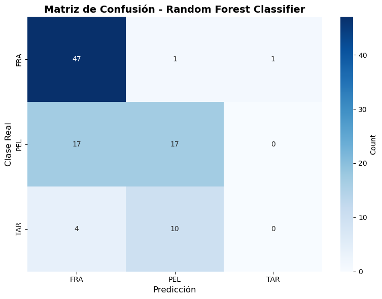
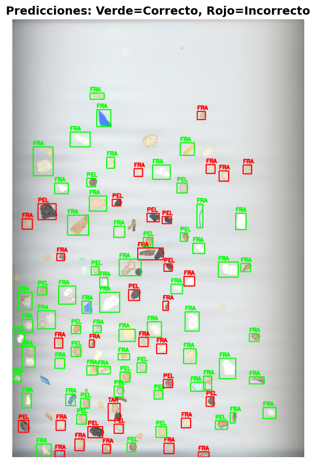

## Primer Ejercicio 

Este código implementa un sistema de detección y clasificación de monedas mediante visión por computadora. El programa identifica monedas en una imagen, permite seleccionar una moneda de referencia (1 euro) mediante clic del mouse, y luego clasifica automáticamente todas las monedas detectadas calculando el valor total.

El código para realizar esta funcion en primer lugar carga la imagen correspondiente, para el caso base 'Monedas.jpg'.
Convierte a escala de grises y aplica filtro de desenfoque para mejorar la detección. 

Como segundo paso trata de detectar los circulos de las monedas. Para ello utiliza la transformada de Hough para detectar formas circulares (en este caso las monedas).

A continuación utiliza un sistema de clasificación para saber qué moneda es la que esta tratando. Para esto se emplean dos estructuras:

Diccionario de proporciones: Relaciona tamaños relativos entre monedas.

Diccionario de valores: Asigna valor monetario a cada tipo de moneda.

La moneda de 1 euro sirve como referencia para calcular las proporciones.

Finalmente el programa interactúa con el usuario mediante el siguiente flujo: 

1) Usuario hace clic en la moneda de 1 euro para establecer referencia.

2) Muestra imagen con círculos detectados.

3) Calcula automáticamente todas las monedas basándose en proporciones para ello realiza un bucle en el que para cada moneda detectada, calcula la proporción entre su diámetro y el de referencia. Compara esta proporción con valores predefinidos de las monedas euro. Identifica cada moneda encontrando la proporción más cercana y calcula el valor total.

Para realizar la interpretación de los resultados se dibujan círculos verdes alrededor de las monedas detectadas, se etiqueta cada moneda con su denominación y finalmente se muestra el valor total calculado en euros (la suma de los valores de las monedas detectadas).

Como vemos, a pesar de haber empleado únicamente los diámetros de los círculos, sin filtrar por color o similares, el resultado es muy cercano al real en la imagen de test, teniendo algunas dificultades para diferenciar la moneda de 2 cts de la de 10 cts al tener un diámetro muy similar.

En esta segunda imagen, en un entorno más natural, vemos como, en líneas generales, detecta los contornos de forma menos precisa, haciendo que confunda monedas de diámetros similares, al no detectar de forma robusta los contornos de estas.

## Segundo Ejercicio

En esta segunda tarea se parte de las imágenes proporcionadas para cada clase de microplástico, tanto los recortes como las imágenes originales (para obtener una mayor cantidad de características). 
Para el entrenamiento del modelo, primero deben extraerse las características de cada imagen. En este caso, para la extracción de dichas características, se emplean los umbrales binario y Otsu, para intentar aislar las partículas del fondo. 

Tras esto, haciendo uso de las funcionalidades que ofrece OpenCV, se generan 18 características por imagen, siendo algunas de estas los contornos, áreas, perímetros, la compacidad, relaciones de aspecto, y características de color. Todo este proceso se centraliza en una única función definida como "extract_features".

La función es empleada con cada una de las imágenes de entrenamiento (2 imágenes por clase), y son escaladas con StandardScaler, para evitar que las características con valores significativamente mayores dominen el aprendizaje del modelo.

Para la clasificación se ha empleado un Random Forest, que es entrenado con las características ya escaladas y las etiquetas de las imágenes de entrenamiento. Posteriormente, se obtienen todas las partículas etiquetadas en el csv de la imagen de test y se le pasan al modelo entrenado, para obtener una predicción.

Finalmente, comparando los valores predichos con los valores reales, se calculan las métricas de rendimiento más comunes (precisión, recall y F1-score), y se genera la matriz de confusión, para poder visualizar el desempeño del modelo de clasificación.

Matriz de confusión:

Predicciones:

### Conclusiones

Debido a la escasa cantidad de imágenes para el entrenamiento proporcionadas como material en la práctica, y a la dificultad del problema (partículas muy similares, ruido en las imágenes), es complicado obtener resultados satisfactorios y aplicables a un problema real. Sin embargo, para haber realizado el entrenamiento bajo dichas condiciones, una precisión global del 66% no es un mal resultado.

### Otros posibles enfoques

Para obtener mejores resultados, podría aumentarse la cantidad de imágenes de cada tipo de partícula, ajustando así las características obtenidas. Además, podría añadirse al entrenamiento la textura de cada partícula, de forma que sea un factor determinante para su clasificación.