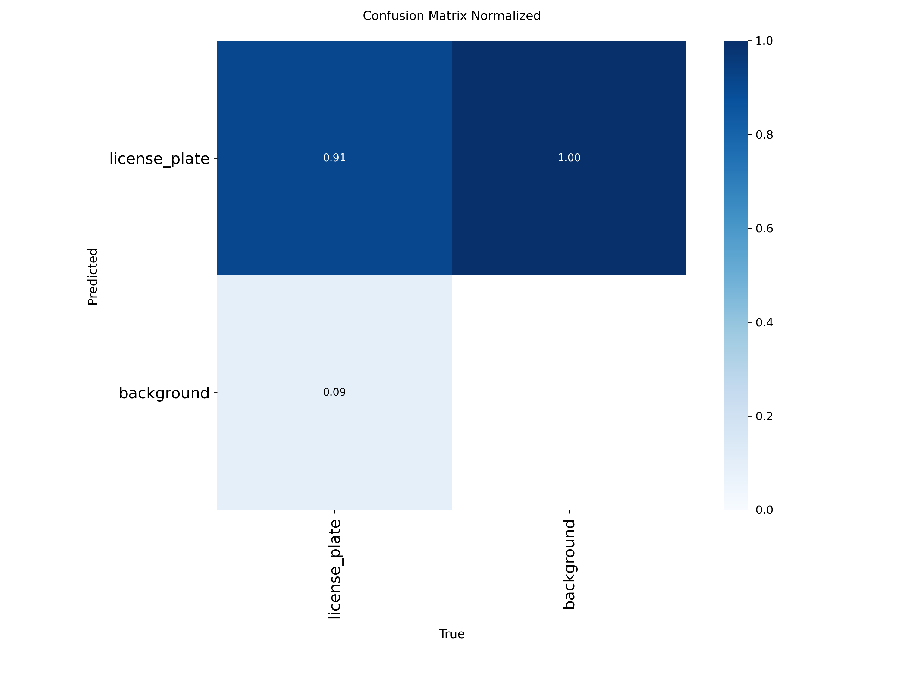
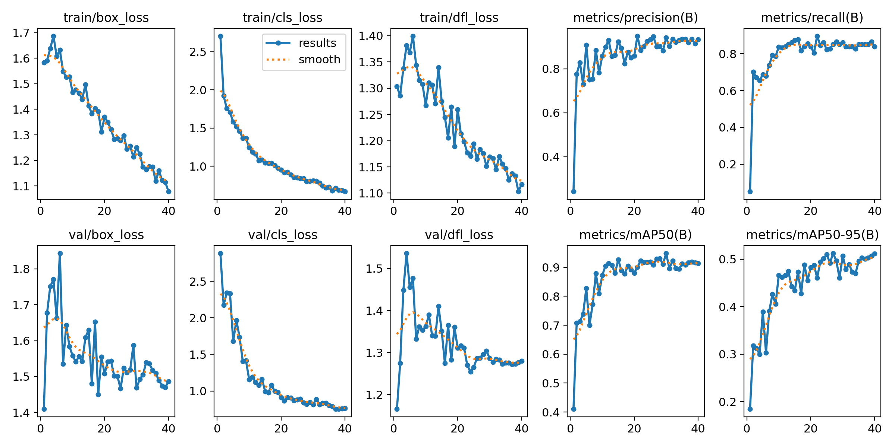
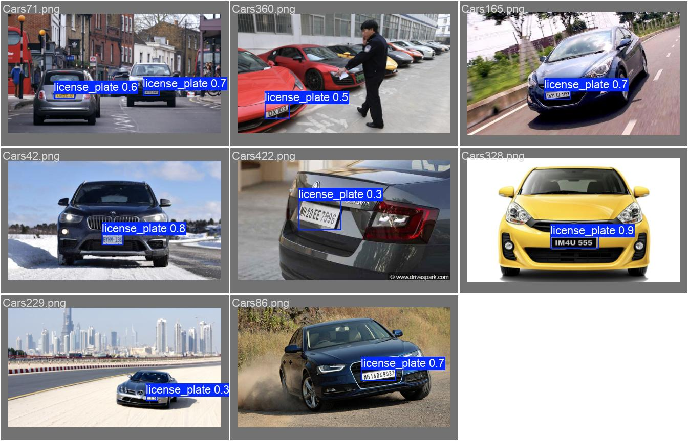
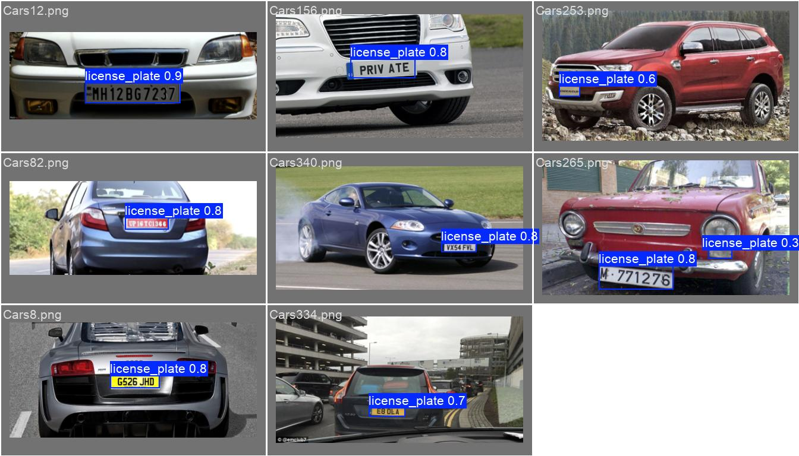
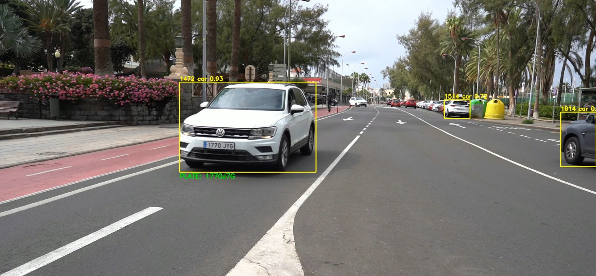
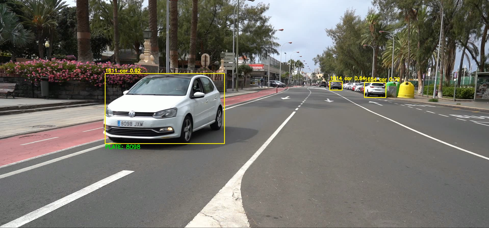
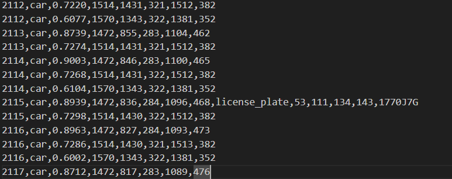
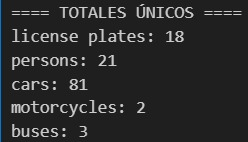

# PRACTICA 4

## Objetivo 

Este código implementa un sistema completo de visión por computadora para la detección, seguimiento y reconocimiento de matrículas de vehículos en tiempo real mediante procesamiento de video.
El sistema combina múltiples tecnologías de inteligencia artificial para lograr un análisis del tráfico.

### Arquitectura 

El programa utiliza una arquitectura de dos modelos YOLO (You Only Look Once) en cascada y la deteccion alfanumérica de las matriculas se ha realizado mediante modelos como Tesseract OCR o EasyOCR.
El primer modelo (yolo11n.pt) se encarga de la detección y seguimiento general de objetos, centrándose específicamente en vehículos relevantes (coches, autobuses, motocicletas) y peatones.
El segundo modelo, que hemos entrenado para detección de matriculas, se dedica exclusivamente a la detección de estas, y lo empleamos para detectarlas dentro de las bbox de coches, guaguas y motocicletas previamente detectadas por yolov11 preentrenado. 
El texto de la matrícula es extraído usando Tesseract OCR o EasyOCR.

### Enlace a los vídeos de output

https://drive.google.com/drive/folders/1TYwcRL6MQN_g6kJ9JJnFzfuJeSXkgT67?usp=sharing

### Descripción del dataset

Para el entrenamiento se ha empleado el siguiente dataset: https://www.kaggle.com/datasets/sujaymann/car-number-plate-dataset-yolo-format

Este dataset está compuesto de 433 imágenes de matrículas desde diferentes distancias y perspectivas, y ha sido etiquetado no con el texto de la matrícula, sino con la bounding box de esta.
Se divide en 346 imágenes de entrenamiento y 87 imágenes de validación.

### Entrenamiento del modelo

Antes de comenzar el código, se ha llevado a cabo un entrenamiento de yolov11 para detección de matrículas, partiendo de no tener ningún peso, con un dataset con imágenes de matrículas encontrado en Roboflow y debidamente etiquetado. Este entrenamiento ha obtenido unos resultados adecuados, obteniendo un accuracy superior al 90%, y un recall y un f1-score muy elevados, por encima del 85%. Adjuntamos, además, imágenes de diferentes batches de test con las matrículas predichas.

### Flujo del codigo 

El código presenta la siguiente estructura:
En primera instancia cada frame del video es analizado por el modelo principal de YOLO, que identifica vehículos y asigna IDs únicos de seguimiento mediante el tracker persistente.
Con esta informacion se va realizando un conteo de vehículos únicos,  el sistema mantiene registros individuales por tipo de vehículo.
Posteriormente se realiza una detección de matrículas: para cada vehículo detectado se recorta la región de interés y se pasa al segundo modelo YOLO que hemos entrenado para localizar matrículas.
Cada matrícula detectada es procesada de la siguiente manera: conversión a escala de grises, mejora de contraste con CLAHE, filtrado gaussiano, umbralización adaptativa y escalado en caso de ser una imagen muy pequeña, todo esto para mejorar la legibilidad de las imágenes y procurar un reconocimiento más preciso.
Finalmente el texto de la matrícula es extraído usando tanto EasyOCR como Tesseract OCR configurados específicamente para caracteres alfanuméricos, con técnicas de post-procesamiento para validar y refinar los resultados.

A lo largo de este proceso se implementan mecanismos de optimización, como un sistema de cache que trata de almacena matrículas reconocidas exitosamente para evitar reprocesamiento innecesario y asegurar obtener siempre el mejor resultado para cada objeto, un sistema de reintentos controlados cada 5 frames si la lectura inicial no es confiable, se realiza un filtrado de los resultados mediante longitud mínima, se filtra según la confianza y se emplea una lista de caracteres permitidos para evitar caracteres extraños.

### Salida Generada 

El código propuesto genera varias salidas:

1) Archivo CSV con todas las detecciones, coordenadas, IDs de seguimiento y confianzas, además del texto de la matrícula en caso de encontrarlo.

2) Video de salida con bounding boxes, IDs y matrículas superpuestas.

3) Archivo de texto con las matrículas reconocidas.

4) Estadísticas en consola con el conteo único de vehículos por categoría.

   

5) Conteo por terminal de las distintas instancias de cada clase detectadas por el modelo.

   

Como se puede observar por la salida obtenida, el modelo es capaz de realizar un recuento de los distintos elementos detectados en el vídeo.

### Resultados obtenidos 

Se ha observado que  el reconocimiento de texto con Tesseract y EasyOCR tiene ciertas limitaciones, pues a pesar de detectar con bastante precisión las matrículas, son muy pocos los casos en los que extrae correctamente el texto de estas.

Como posibles siguientes pasos podría probarse con modelos más pesados de reconocimiento de caracteres para intentar mejorar la extracción de estos.

