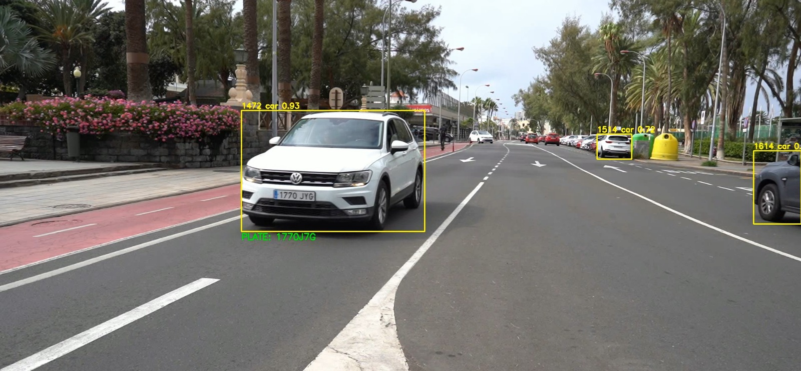
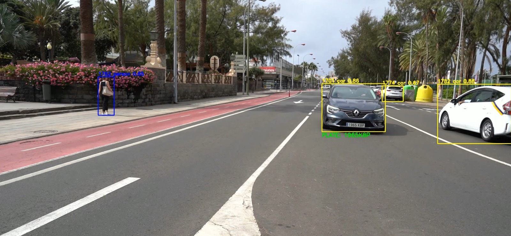

# PRACTICA 4

## Objetivo 

Este código implementa un sistema completo de visión por computadora para la detección, seguimiento y reconocimiento de matrículas de vehículos en tiempo real mediante procesamiento de video.
El sistema combina múltiples tecnologías de inteligencia artificial para lograr un análisis del tráfico.

### Arquitectura 

El programa utiliza una arquitectura de dos modelos YOLO (You Only Look Once) en cascada y la deteccion alfanumérica de las matriculas se ha realizado mediante modelos como Tesseract OCR o EasyOCR.
El primer modelo (yolo11n.pt) se encarga de la detección y seguimiento general de objetos, centrándose específicamente en vehículos relevantes (coches, autobuses, motocicletas) y peatones.
El segundo modelo, especializado matriculas, se dedica exclusivamente a la detección de matrículas dentro de los vehículos identificados. 
El texto de la matrícula es extraído usando Tesseract OCR o EasyOCR.

### Flujo del codigo 

El coódigo presenta la siguiente estructura:
En primera instancia cada frame del video es analizado por el modelo principal de YOLO, que identifica vehículos y asigna IDs únicos de seguimiento mediante el tracker persistente.
Con esta informacion se va realizando un conteo de vehículos únicos,  el sistema mantiene registros individuales por tipo de vehículo.
posteriormente se realiza una detección de matrículas: Para cada vehículo detectado, se recorta la región de interés y se pasa al segundo modelo YOLO especializado en localizar matrículas.
Cada amtrícula detectada es proceada de la siguiente manera: Conversión a escala de grises, Mejora de contraste con CLAHE, Filtrado Gaussiano, Umbralización adaptativa y Escalado para mejorar legibilidad.
Finalmente el texto de la matrícula es extraído usando Tesseract OCR configurado específicamente para caracteres alfanuméricos, con técnicas de post-procesamiento para validar y refinar los resultados.

A lo largo de este proceso se intentan implementar mecanismos de optimización como un sistema de cache que trata de almacena matrículas reconocidas exitosamente para evitar reprocesamiento innecesario, un sistema de 
reintentos controlados cada 5 frames si la lectura inicial no es confiable el filtrado de  lecturas mediante longitud mínima, probabilidad de confianza y lista de caracteres permitidos o  el descarte de 
matrículas demasiado pequeñas o con baja confianza de detección. 

### Salida Generada 

El código propuesto genera varias salidas:

1) Archivo CSV con todas las detecciones, coordenadas, IDs de seguimiento y confianzas

2) Video de salida con bounding boxes, IDs y matrículas superpuestas

3) Archivo de texto con las matrículas reconocidas

4) Estadísticas en consola con el conteo único de vehículos por categoría

   

### Resultados obtenidos 

Se ha observado que  el reconocimiento de texto con Tesseract y EasyOCR tiene limitaciones a la hora de realizar la tarea de la traducción.
La migración a modelos más pesados como SmallVM representaría una mejora significativa en la precisión general del sistema, particularmente en el reconocimiento de matrículas bajo condiciones desafiantes.

